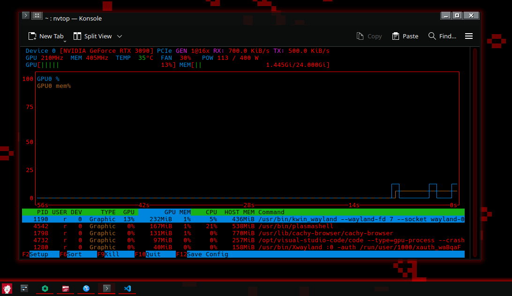

# KDE - themes

A collection of custom and modified KDE Plasma themes.

## 📂 Themes

### Red Glass




- **Description**: A bright red variant of the popular “Black Glass” theme.  
- **Origin**: Based on [Black Glass by phob1an](https://www.opencode.net/phob1an/blackglass).  
- **Modifications**: All I did was update the SVG `<stop>` and `fill` hex codes from the original greys to `#ff0000` (red).

## 🚀 Installation

1. Clone this repository:
   ```bash
   git clone https://github.com/your -username/KDE -themes.git
   ```
2. Copy the theme folder into your local Plasma themes directory:
   ```bash
   cp -r KDE -themes/Red\ Glass ~/.local/share/aurorae/themes/
   ```
3. Open **System Settings → Application Style → Window Decorations**, select **Red Glass**, and click **Apply**.
4. To apply panel/widgets icons, copy any modified `.svg` files into:
   ```bash
   ~/.local/share/plasma/desktoptheme/Red\ Glass/icons/
   ```
   then reload Plasma:
   ```bash
   kquitapp5 plasmashell && kstart5 plasmashell
   ```

## ❤️ Credits

- **Original Theme**: “Black Glass” by [phob1an](https://www.opencode.net/phob1an/blackglass).  
- **Modifications**: This repo contains only SVG hex -code tweaks—no original artwork was created here.

## 🤝 Contributing

If you create a new Plasma theme or fork an existing one, feel free to open a pull request. Please include:

- Theme name and brief description  
- Link to the original source, if applicable  
- A summary of your modifications  

## 📄 License

This repository is released under the [MIT License](LICENSE).  
Original theme “Black Glass” remains under its original license—see [phob1an’s repo](https://www.opencode.net/phob1an/blackglass) for details.

